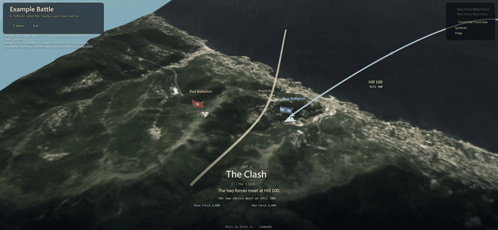

<div align="center">

# cinematic-3d-battle-engine

### Turn **any battle, historical or fictional**, into a **self-playing 3D documentary** on **real-scale satellite and elevation terrain**. No build, no backend, no API keys. Build your own by **just asking an AI**.

[](https://keithligh.github.io/cinematic-3d-battle-engine/)
&nbsp;
[](PROMPT.md)
&nbsp;
[](https://github.com/keithligh/cinematic-3d-battle-engine)

[](LICENSE)
[](https://creativecommons.org/licenses/by/4.0/)
[](https://threejs.org/)
[](#quick-start)

[](https://keithligh.github.io/cinematic-3d-battle-engine/)

**▶ [Try the live demo](https://keithligh.github.io/cinematic-3d-battle-engine/)** &nbsp;·&nbsp; **🤖 [Build your own: just ask an AI](#build-your-own-just-ask-an-ai)**

</div>

---

This is the open-source engine that renders **any battle, historical or fictional, as a self-playing 3D documentary**. A
cinematic camera **directs itself** through the campaign over **real elevation and satellite imagery** projected to
scale, with troop movements, period flags, bilingual narration, weather, and a day/night cycle. Everything is
**data-driven**: you describe a battle in one data file, the engine renders it, and the engine modules themselves never
change from one battle to the next. **Every frame is the live engine. Nothing is mocked up.** No build step, no backend,
no API keys: one folder of static files that runs in any browser.

The repo ships a small fictional **"Example Battle"** (Blue Force vs Red Force) so it plays itself the moment you clone
it. The same engine already carries two finished documentaries end to end:
**[The Battle of Hong Kong, 1941](https://github.com/keithligh/battle-of-hong-kong-1941)** and
**[D-Day: The Normandy Landings, 1944](https://github.com/keithligh/d-day-normandy-1944)**.

## Highlights

- 🌍 **Real Earth, to scale.** Actual SRTM elevation and Sentinel-2 satellite imagery, projected by real lng/lat. Any land or coastal geography on the planet, from global, key-less tile providers.
- 🎬 **It directs itself.** A cinematic "Director" plays the campaign as a sequence of shots; grab the camera any time to free-look, and it resumes.
- 🧩 **Data-driven, engine never touched.** A battle lives in `data.js` and `flags.js`; the engine modules read every value from the data and never change from one battle to the next.
- 🌐 **Any side, any language.** Any number of forces, bilingual by design, any script including right-to-left (`meta.fonts`, `meta.dir`).
- 🎨 **Any look.** A per-battle film grade, sky, sea, sun and fog via `meta.theme`: the same engine renders a sunlit landing or a rain-soaked night.
- 🛡️ **Fails loud, not silent.** A boot validator names the exact missing or mistyped field, in the browser and from the command line (`node tools/validate.mjs`), so a broken `data.js` never half-renders.
- 📚 **Honest by design.** `notes.sources` is a required field: the engine will not start a battle that cites no sources.
- ⚡ **Zero infrastructure.** Static files, Three.js r128, no build step, no backend, no API keys; runs offline.

> The bundled Example Battle is a deliberately bare Blue-vs-Red skeleton, the starting point you replace with your own. The finished documentaries built on the same engine ([Hong Kong](https://keithligh.github.io/battle-of-hong-kong-1941/), [D-Day](https://keithligh.github.io/d-day-normandy-1944/)) show what it renders once a real battle is described in data.

> _If this made you think "wow, AI can build that?", a ⭐ helps other people find it._

## Build your own: just ask an AI

You do not need to write code, and you do not need to be a coder. Fork this repo, open it in an AI coding agent
([Claude Code](https://claude.com/claude-code), Codex, or similar), and ask it to build your battle. The agent does the
work: it researches the history, writes the data, draws the period flags, sets the map, and runs it. **You direct and
fact-check; the agent builds.** That is the whole idea: a finished 3D documentary of any battle without you ever
touching the engine.

A ready starting prompt ships right here in the repo: **[PROMPT.md](PROMPT.md)**. (The
[Battle of Hong Kong](https://github.com/keithligh/battle-of-hong-kong-1941) began the same way, from its own
[PROMPT.md](https://github.com/keithligh/battle-of-hong-kong-1941/blob/main/PROMPT.md).) The agent's full runbook is
**[AGENTS.md](AGENTS.md)**, and the field reference it follows is **[PLAYBOOK.md](PLAYBOOK.md)**.

## Quick start

Map tiles load over HTTP, so serve the folder (opening `index.html` via `file://` will **not** work).

1. **Fetch the terrain and imagery tiles for the example** (first time only):
   ```
   node tools/fetch_tiles.mjs
   ```
   This downloads the elevation and satellite imagery for the Example Battle's bounding box from their source providers into `lib/tiles/`. No account or API key is required.

2. **Serve and open:**
   ```
   node tools/serve.js
   ```
   then open <http://localhost:5050>. (Windows: double-click **`start.bat`**; macOS/Linux: `sh start.sh`.)

You should see the fictional Example Battle play itself over real Italian coastal terrain. Now read **[PLAYBOOK.md](PLAYBOOK.md)** and make it yours.

## Under the hood

You do not have to know any of this, but it is why an AI can build a whole documentary by editing data alone: **a battle is a data project, not an engine project.** The battle layer is `data.js` (forces, dated movements, the storyboard, narration), `flags.js` (each side's flag art), and the `index.html` title and social meta. The engine modules (`config.js`, `app.js`, `core.js`, `terrain.js`, `director.js`, and the rest) read every value from the data and never change from one battle to the next.

## How it works

- **Terrain:** AWS "Terrarium" elevation tiles (SRTM/USGS, public domain) decoded to a real height-mesh, Web-Mercator, to scale (with a fixed vertical exaggeration for legibility).
- **Surface:** EOX *Sentinel-2 cloudless 2016* satellite imagery draped over the terrain.
- **Direction:** a state-machine "Director" plays a fixed storyboard of shots; grab the camera to free-look and it resumes.
- **Data contract:** `validate.js` defines exactly what a renderable battle needs, and the same file runs at boot and from the CLI (`node tools/validate.mjs`), so the two can never disagree.

## How it was built

This engine was built through **agentic engineering**: it started from an initial prompt and was engineered, pass by pass, into a reusable, battle-agnostic system. The interesting part is not the AI, it is the architecture and the judgment around it. To build a battle of your own on top of it, [just ask an AI](#build-your-own-just-ask-an-ai).

## Licensing

- **Code** (the `.js` source, `index.html`, `tools/`): **MIT**, see [`LICENSE`](LICENSE).
- **The bundled Example Battle's text content:** **CC BY 4.0**, <https://creativecommons.org/licenses/by/4.0/>.
- **Bundled and fetched third-party software and data** (Three.js, the Sentinel-2 imagery, the SRTM/USGS elevation) keep their own licenses; see [`THIRD_PARTY_NOTICES.md`](THIRD_PARTY_NOTICES.md).
- Battles you build carry whatever license you choose for your own `data.js` content.

## Credits and data sources

- Satellite imagery: **Sentinel-2 cloudless 2016 © EOX IT Services GmbH** (s2maps.eu); contains modified Copernicus Sentinel data.
- Elevation: **SRTM, courtesy U.S. Geological Survey** via AWS Terrain Tiles.
- 3D engine: **Three.js** (MIT).

## Built two documentaries already

The engine is proven on real history. See it carry a full campaign end to end:

- **[The Battle of Hong Kong, 1941](https://github.com/keithligh/battle-of-hong-kong-1941)** ([live](https://keithligh.github.io/battle-of-hong-kong-1941/)): the 18-day battle on the real terrain of Hong Kong, in 中文 and English.
- **[D-Day: The Normandy Landings, 1944](https://github.com/keithligh/d-day-normandy-1944)** ([live](https://keithligh.github.io/d-day-normandy-1944/)): the 6 June 1944 assault on the Normandy coast, with the Allied and Wehrmacht (Iron Cross / Balkenkreuz) insignia of the day.

## Security

Found something? See [`SECURITY.md`](SECURITY.md) for how to report it.

## Author

Built by **Keith Li**. Find me on [LinkedIn](https://www.linkedin.com/in/keithlihk/).
